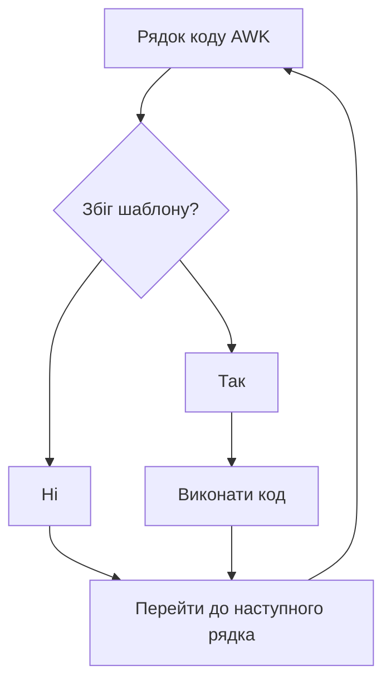

```awk
pattern { action }
```

- [[awk]] читає вхідні рядки один за одним, шукаючи відповідність шаблонам
- кожен рядок перевіряється на відповідність кожному шаблону
- якщо є збіг — виконується дія `{ action }`
- після виконання усіх дій — обробляється наступний рядок
- дії записуються у фігурних дужках, щоб відрізнити їх від шаблону



## Правила пропуску шаблону та дій

- якщо пропустити **шаблон**, він буде відповідати кожному рядку (`/.*/ { action }`)
- якщо пропустити **дію**, для кожного рядка, що відповідає шаблону, буде виконена стандартна дія **друк** усього рядка `print $0` (`/some-regex/ { print $0 }`)